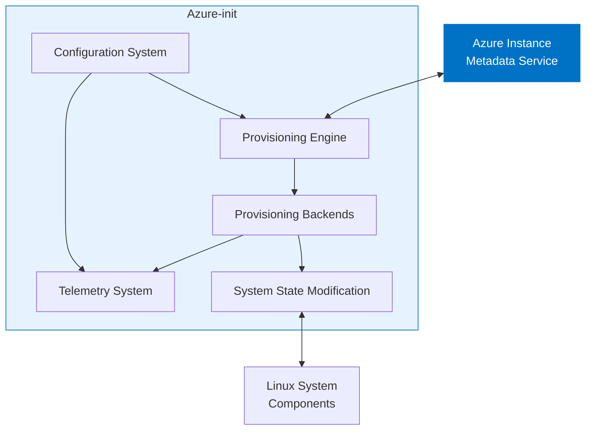

# Azure-init Architecture

## Overview

Azure-init is a lightweight provisioning agent designed to initialize Linux virtual machines in Azure. This document provides a high-level architectural overview of the system.

## System Architecture

<!-- This will be rendered by GitHub -->

## Core Components

### 1. Configuration System

The configuration system is responsible for loading, validating, and merging configuration from various sources:

- Built-in defaults
- Base configuration file (`/etc/azure-init/azure-init.toml`)
- Configuration directory (`/etc/azure-init/azure-init.toml.d/`)
- Command-line overrides

### 2. Provisioning Engine

The provisioning engine is the central component that orchestrates the VM initialization process:

1. Retrieves metadata from Azure services
2. Parses and validates provisioning data
3. Delegates specific provisioning tasks to specialized backends
4. Monitors and reports on the provisioning process

### 3. Provisioning Backends

Azure-init uses pluggable backends for different provisioning tasks:

- **User Management**: Creates and configures user accounts
- **SSH Configuration**: Sets up SSH keys and related configurations
- **Hostname Provisioning**: Configures the VM hostname
- **Password Management**: Handles password-related operations

### 4. Telemetry System

The telemetry system provides comprehensive tracing and monitoring capabilities:

- **EmitKVPLayer**: Integrates with Hyper-V KVP for Azure platform monitoring
- **OpenTelemetryLayer**: Enables distributed tracing
- **stderr Layer**: Provides human-readable logging

### 5. System State Modification

Azure-init interacts with the operating system through controlled interfaces:

- System commands (`useradd`, `hostnamectl`, etc.)
- File system operations
- Service configuration

## Data Flow

1. Azure-init starts and loads its configuration
2. The provisioning engine retrieves metadata from IMDS
3. Based on the metadata, the engine determines required provisioning actions
4. Provisioning backends execute the necessary system changes
5. Status and telemetry data are recorded throughout the process
6. Upon completion, azure-init exits, leaving the VM properly configured

## Security Considerations

Azure-init is designed with security in mind:

- **Minimal Permissions**: Only requests the system privileges it needs
- **Secure Data Handling**: Properly manages sensitive data like passwords
- **Input Validation**: Validates all input from Azure services
- **Idempotent Operations**: Ensures multiple executions don't cause issues

## Integration Points

### Azure Platform Integration

- **Instance Metadata Service (IMDS)**: Primary source of VM configuration data
- **Wireserver**: Used for additional Azure platform communication
- **Hyper-V KVP**: Mechanism for reporting status back to Azure

### Operating System Integration

- **systemd**: For service management and early-boot integration
- **PAM/NSS**: For user and authentication management
- **SSH**: For secure remote access configuration

## Performance Characteristics

Azure-init is optimized for:

- **Fast Startup**: Minimizing VM initialization time
- **Low Resource Usage**: Small memory and CPU footprint
- **Reliability**: Handling transient failures gracefully

## Further Reading

- [Configuration Documentation](configuration.md)
- [Tracing System](libazurekvp.md)
Comment view- [End-to-End Testing](../docs/E2E_TESTING.md)