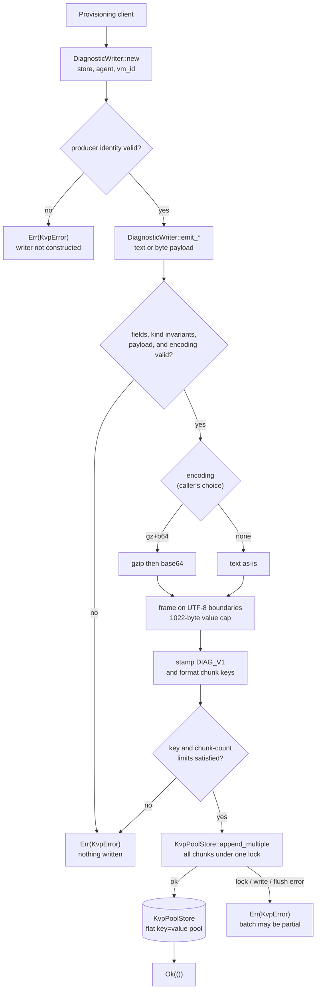
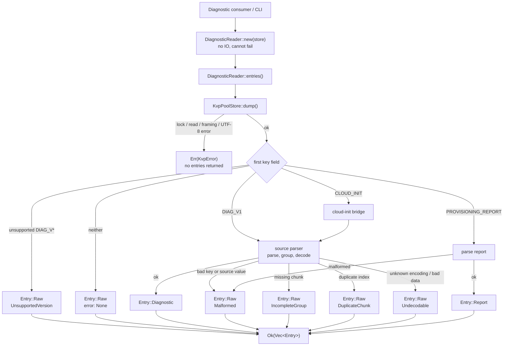

# KVP Diagnostics Specification

## Background

Diagnostics explain what a provisioning client did during boot: spans mark the start and finish of operations such as `provision:run`, while point observations capture events or artifacts such as an IMDS result or `dmesg` snapshot. They let operators reconstruct a boot and triage failures even when the guest is unreachable.

A Hyper-V guest exposes these records to the host through a KVP pool, a flat key=value namespace. `KvpPoolStore` provides raw, in-order access but no diagnostic semantics.

The pool constrains the design in four ways:

- Records are flat key=value pairs; keys hold structured metadata and values are opaque bytes.
- Safe limits are 254-byte keys and 1022-byte values. Larger values span records whose keys differ by a trailing index.
- The host may copy or truncate the pool at any moment, leaving group members missing, duplicated, or out of order.
- Grouping and typing exist only by convention in the key and value.

This spec defines the versioned format emitted by azure-init, its writer, and a reader for the pool. cloud-init uses a separate format supported read-only through the compatibility bridge.

### Records today

azure-init uses a pipe-delimited key with a plain-text value and no encoding field. Its `type` is `start`, `finish`, or `event`; oversized values use a trailing chunk index:

```text
<agent>|<boot_epoch>|<vm_id>|<type>|<name>|<event_id>|<timestamp>|<chunk_index>

# point event, one record
azure-init-0.1.1|1700000000|vm-abc|event|imds|8f3e9c4a-1b2c-4d5e-9f01-234567890abc|2026-07-27T21:33:24.300Z|0
  value: Retrieved 1 key from IMDS

# span start
azure-init-0.1.1|1700000000|vm-abc|start|provision:run|9c1d2e3f-4a5b-6c7d-8e9f-0a1b2c3d4e5f|2026-08-31T12:34:56.789Z|0
  value: starting

# span finish, same event_id as its start
azure-init-0.1.1|1700000000|vm-abc|finish|provision:run|9c1d2e3f-4a5b-6c7d-8e9f-0a1b2c3d4e5f|2026-08-31T12:34:57.101Z|0
  value: provisioning succeeded

# long value split across records, one event_id, indices 0..N
azure-init-0.1.1|1700000000|vm-abc|event|config:dump|1a2b3c4d-5e6f-7a8b-9c0d-1e2f3a4b5c6d|<ts>|0   value: <chunk 0>
azure-init-0.1.1|1700000000|vm-abc|event|config:dump|1a2b3c4d-5e6f-7a8b-9c0d-1e2f3a4b5c6d|<ts>|1   value: <chunk 1>
```

cloud-init puts type and name before the identifiers; current keys carry a `vm_id` that older keys omit. Values are JSON with `ts` and `msg`; finishes add `result` and `duration`, splits add `msg_i`, and compressed artifacts embed `{encoding, data}` in `msg`:

```text
current  CLOUD_INIT|<incarnation>|<type>|<name>|<vm_id>|<event_id>[|<chunk_index>]
older    CLOUD_INIT|<incarnation>|<type>|<name>|<event_id>[|<chunk_index>]

# span finish with result and duration (current key)
CLOUD_INIT|1785187982|finish|modules-final/config-scripts_user|0e5e179d-5341-478b-8456-fbb90621bdf8|e5f01809-a7a3-4279-aa64-1f18e21eda6e
  value: {"name":"modules-final/config-scripts_user","type":"finish","ts":"2026-07-27T21:33:24.339006+00:00","result":"SUCCESS","duration":0.00064,"msg":"config-scripts_user ran successfully and took 0.001 seconds"}
  msg -> "config-scripts_user ran successfully and took 0.001 seconds"

# span start, no result or duration
CLOUD_INIT|1785187982|start|modules-final/config-ssh_authkey_fingerprints|0e5e179d-5341-478b-8456-fbb90621bdf8|c4d4a08d-fe93-4c7a-9be6-9a38c212e212
  value: {"name":"modules-final/config-ssh_authkey_fingerprints","type":"start","ts":"2026-07-27T21:33:24.339170+00:00","msg":"running config-ssh_authkey_fingerprints with frequency once-per-instance"}
  msg -> "running config-ssh_authkey_fingerprints with frequency once-per-instance"

# older key without vm_id (five base fields)
CLOUD_INIT|1785187982|finish|modules-final|126f969f-13fd-4b4b-a136-b7114518491f
  value: {"name":"modules-final","type":"finish","ts":"2026-07-27T21:33:24.431885+00:00","result":"SUCCESS","duration":0.340712044,"msg":"running modules for final"}
  msg -> "running modules for final"

# point event
CLOUD_INIT|1785187982|event|network-config|0e5e179d-5341-478b-8456-fbb90621bdf8|a1b2c3d4-e5f6-7a8b-9c0d-1e2f3a4b5c6d
  value: {"name":"network-config","type":"event","ts":"2026-07-27T21:33:20.100000+00:00","msg":"applied fallback network configuration"}
  msg -> "applied fallback network configuration"

# system-info (not a timeline position; the subject is in name)
CLOUD_INIT|1785187982|system-info|system information|0e5e179d-5341-478b-8456-fbb90621bdf8|b2c3d4e5-f6a7-8b9c-0d1e-2f3a4b5c6d7e
  value: {"name":"system information","type":"system-info","ts":"2026-07-27T21:33:19.500000+00:00","msg":"cloud-init running on Ubuntu"}
  msg -> "cloud-init running on Ubuntu"

# split value: each chunk carries msg_i, and a JSON \n escape is split across the boundary
CLOUD_INIT|1785187982|finish|modules-final|0e5e179d-5341-478b-8456-fbb90621bdf8|c3d4e5f6-a7b8-9c0d-1e2f-3a4b5c6d7e8f|0
  value: {"name":"modules-final","type":"finish","ts":"2026-07-27T21:33:24.43Z","msg_i":0,"msg":"line1\"}
CLOUD_INIT|1785187982|finish|modules-final|0e5e179d-5341-478b-8456-fbb90621bdf8|c3d4e5f6-a7b8-9c0d-1e2f-3a4b5c6d7e8f|1
  value: {"name":"modules-final","type":"finish","ts":"2026-07-27T21:33:24.43Z","msg_i":1,"msg":"nline2"}
  msg -> "line1\nline2" (reassembled from the two chunks)

# compressed artifact: type=compressed, msg holds an {encoding, data} envelope; a large one splits like the value above
CLOUD_INIT|1785187982|compressed|dmesg|0e5e179d-5341-478b-8456-fbb90621bdf8|d4e5f6a7-b8c9-0d1e-2f3a-4b5c6d7e8f90|0
  value: {"name":"dmesg","type":"compressed","ts":"2026-07-27T21:33:25.00Z","msg_i":0,"msg":"{\"encoding\":\"gz+b64\",\"data\":\"H4sIAAAA...\"}"}
  msg -> {"encoding":"gz+b64","data":"H4sIAAAA..."}
```

The formats differ in field order, metadata placement, and value representation.

## Proposed design

The design adds separate interfaces over `KvpPoolStore`: a reader interprets the pool, and a writer emits the versioned format. Untyped callers use `KvpPoolStore` directly.

### Diagnostics format

The proposed key keeps metadata in a pipe-delimited key with `|` reserved. It begins with a schema ID and ends with the chunk index, including `|0` for a single-record value:

```text
DIAG_V1|<agent>|<vm_id>|<kind>|<name>|<event_id>|<timestamp>|<encoding>|<result>|<duration>|<chunk_index>
```

- `DIAG_V1` is the `diagnostic_version_id`: `DIAG` identifies the format family and `V1` its schema. The schema defines layout, field requirements, tokens, units, encoding, and chunking; `agent` separately identifies the producer. The combined token distinguishes unsupported `DIAG_V*` records from unrelated keys. Schema changes require a new ID; agent releases do not.
- `boot_epoch` is removed because timestamps identify occurrences and stale-pool cleanup removes prior-boot records.
- `type` becomes `kind`, limited to the timeline positions `start`, `finish`, and `event`; `name`, `encoding`, and `result` carry other classifications.
- `encoding` in the key supports compressed payloads.
- `result` (`success` or `fail`) and `duration` (milliseconds) are required on finishes, optional on events, and empty on starts. Values otherwise remain plain text or encoded artifacts.

| Field | Meaning |
|---|---|
| diagnostic_version_id | `DIAG_V1`; identifies the wire schema and selects its parser before any later field is interpreted |
| agent | Producer identifier, such as `azure-init-0.1.1` |
| vm_id | VM identity |
| kind | `start` or `finish` for a span, `event` for a point observation |
| name | Subject, such as `provision:run` or `dmesg` |
| event_id | Shared by a span's start and finish, and by every chunk of one value |
| timestamp | RFC 3339 (ISO 8601), UTC with a `Z` suffix, millisecond precision, e.g. `2026-08-31T12:34:56.789Z` |
| encoding | How the value is encoded: `none` or `gz+b64` |
| result | `success` or `fail` on a finish, optionally on an event; empty otherwise |
| duration | Elapsed milliseconds on a finish, optionally on a timed event; empty otherwise |
| chunk_index | Chunk position, from 0 |

#### Key size

The host silently truncates keys past 254 UTF-8 bytes; safe-mode `KvpPoolStore` rejects them first. Only `agent` and `name` are free-form, so the writer caps them to bound the full key:

| Field | Cap | Bounded by |
|---|---|---|
| diagnostic_version_id | 7 B | fixed `DIAG_V1` token |
| agent | 32 B | free-form producer id |
| name | 48 B | free-form subject |
| vm_id, event_id | 36 B each | GUID / UUID |
| timestamp | 24 B | fixed format |
| duration | 10 B | digits |
| result, encoding, kind | ≤ 7 B each | enum token |
| chunk_index | 4 B | at most 1023 records |

With those caps the worst-case key is 226 bytes, leaving 28 bytes inside the limit. cloud-init reads are never capped; the bridge takes names as they are.

Wire examples with shortened UUIDs or `<ts>` are schematic. Stored `DIAG_V1` records require valid UUIDs and the exact timestamp format above.

### Kinds

`kind` marks timeline position only: `start` opens an operation, `finish` closes one, and `event` is a one-off. These cover every timeline position. Other categories belong in `encoding`, `name`, or `result`; values are messages or artifacts, not kind-specific structures. For cloud-init, `compressed` maps to encoding and `system-info` to name (see Compatibility).

#### start

A `start` opens a measurable operation such as `provision:run`. Its timestamp marks when it began, and its value is a short message. It shares an `event_id` with its finish; an unmatched start signals an incomplete operation after a hang or crash.

```text
DIAG_V1|azure-init-0.1.1|vm-abc|start|provision:run|9c1d2e3f-...|2026-08-31T12:34:56.789Z|none|||0   value: starting
```

#### finish

A `finish` closes the span sharing its `event_id`. It records the later timestamp, `result`, and elapsed `duration` at emit time, so it remains self-contained if the start is lost. Its value is a message such as `provisioning succeeded` or `provisioning failed: <reason>`. The cloud-init bridge maps equivalent value fields (see Compatibility).

```text
DIAG_V1|azure-init-0.1.1|vm-abc|finish|provision:run|9c1d2e3f-...|2026-08-31T12:34:57.101Z|none|success|312|0   value: provisioning succeeded
```

#### event

An `event` is a point observation such as an IMDS result or `dmesg` snapshot. It has its own `event_id` and no span pair. Its payload is text (`none`) or a compressed artifact (`gz+b64`), split by `chunk_index` when needed. It may set `result` or `duration` when applicable.

```text
# plain text, one record
DIAG_V1|azure-init-0.1.1|vm-abc|event|imds|8f3e...|2026-07-27T21:33:24.300Z|none|||0   value: Retrieved 1 key from IMDS

# an event that is itself a failure sets result
DIAG_V1|azure-init-0.1.1|vm-abc|event|imds|7b2c...|2026-07-27T21:33:24.400Z|none|fail||0   value: IMDS unreachable

# a self-contained timing sets duration but no result
DIAG_V1|azure-init-0.1.1|vm-abc|event|imds:probe|5d6e...|2026-07-27T21:33:24.500Z|none||52|0   value: probed IMDS in 52ms

# compressed artifact, split across records, indices 0..N
DIAG_V1|azure-init-0.1.1|vm-abc|event|dmesg|9a1b...|<ts>|gz+b64|||0   value: <base64 of gzip, chunk 0>
DIAG_V1|azure-init-0.1.1|vm-abc|event|dmesg|9a1b...|<ts>|gz+b64|||1   value: <chunk 1>
```

### Payloads

`DiagnosticPayload` distinguishes valid UTF-8 `Text(String)` from arbitrary `Bytes(Vec<u8>)`. Writer methods accept `impl Into<DiagnosticPayload>` with conversions from `&str`, `String`, `&[u8]`, and `Vec<u8>`, avoiding separate method names.

The caller chooses the wire `encoding`; the input type does not infer whether compression is useful:

| Input | `encoding=None` | `gz+b64` |
|---|---|---|
| Text | Store its UTF-8 bytes directly | Encode its UTF-8 bytes |
| Bytes | Validate UTF-8, then store directly; reject invalid UTF-8 | Encode the arbitrary bytes |

On read, `KvpPoolStore::dump()` validates the physical keys and values as UTF-8 before diagnostic parsing. Invalid UTF-8 in any field before its terminating NUL fails the entire snapshot with `KvpError::Io` carrying `InvalidData`; no entries are returned. Record preservation applies only to a successful string-based snapshot, not to arbitrary physical bytes.

Within a successful snapshot, `none` produces `Text`. `gz+b64` produces `Bytes` even when the decoded bytes are valid UTF-8, because the wire does not declare their content type. Its stored base64 is UTF-8 text, so arbitrary decoded bytes do not violate the store contract. Invalid base64 or gzip remains `Undecodable` and falls back to `Raw`.

JSON renders `Text` as a string and `Bytes` as `{ "type": "bytes", "encoding": "base64", "data": "..." }`; this presentation does not change the wire `encoding`.

### Encodings

`encoding` names the KVP value representation and is chosen by the caller, not inferred from size. Keeping it in the key leaves the value opaque. Arbitrary binary uses `gz+b64` because the UTF-8 store trims trailing nulls. `DIAG_V1` omits standalone base64; a later schema can add encodings without changing the key shape. cloud-init declares encoding inside its value (see Compatibility).

Values over 1022 bytes are split across chunks sharing `event_id` and `kind`, ordered by `chunk_index`, and joined before decoding.

#### none

Plain UTF-8 text and the default, used for span messages and short observations. Decoding joins split text in index order.

#### gz+b64

Base64 of one gzip stream, used for compressible artifacts such as `dmesg`. Writing compresses, encodes, then chunks; decoding reverses the process. A visible index gap is `IncompleteGroup`; contiguous truncation is `Undecodable`. This sacrifices partial readability for fewer records.

### Reads and writes

A pool holds many diagnostics. Each is a start, finish, or event, and each is stored as one or more chunks (`chunk_index` 0 to N):

```text
Diagnostics pool
├─ start   provision:run
│  └─ chunk 0
├─ event   imds
│  └─ chunk 0
├─ event   dmesg  (gz+b64, 3 chunks)
│  ├─ chunk 0
│  ├─ chunk 1
│  └─ chunk 2
└─ finish  provision:run
   └─ chunk 0
```

`DiagnosticReader::entries()` reads the pool once through `KvpPoolStore::dump()`. If that snapshot succeeds, each logical item becomes a decoded `Diagnostic`, parsed `ProvisioningReport`, or `Raw` key and value. Unrecognized records are `Raw`; recognized but invalid records are `Raw` with a `DecodeError`, so no record from the successful snapshot is dropped. `KvpPoolStore::dump()` exposes the physical key/value records as UTF-8 strings without diagnostic interpretation.

Any snapshot failure, including invalid physical UTF-8 or malformed physical record framing, returns `KvpError` with no entries, even when other records are valid. Reads do not modify the pool; they neither skip unreadable records nor replace invalid bytes with lossy text. The existing string-based store and `RawKeyValue` interfaces remain unchanged.

Only the exact `PROVISIONING_REPORT` key selects report parsing. Its value is one pipe-delimited CSV record of `key=value` fields, with double-quote escaping for embedded pipes, quotes, or newlines. `result` (`success` or `error`), `agent`, `vm_id`, `pps_type`, and an RFC 3339 `timestamp` are required; error reports also require `reason` and may include `documentation_url`. Field order is not significant. Empty text values remain supported, and identities and timestamps are preserved rather than normalized. Other fields remain ordered supporting data, including duplicate supporting-data keys. Duplicate standard fields, unknown enum tokens, missing required fields, or malformed CSV are `Raw` with `Malformed`, not silently repaired or interpreted with first/last-write-wins semantics.

Writing is the inverse: `DiagnosticWriter` stamps `DIAG_V1`, converts the typed payload according to `encoding`, frames it into records, and appends them to the `KvpPoolStore`.

The reader preserves first-seen pool order: a complete chunk group occupies its first physical position, and failed groups remain raw records at their original positions. The CLI's `dump --parse` renders entries in that same pool order. A span's timeline can be summarized as:

```text
2026-08-31T12:34:56.789Z  start   provision:run
2026-08-31T12:34:57.020Z  event   imds            ok
2026-08-31T12:34:57.101Z  finish  provision:run   success   312ms
```

Fields follow `kind`: a finish always carries `result` and `duration`, a start carries neither, and an event carries either when measured. An unmatched start remains visible as an incomplete operation:

```text
2026-08-31T12:35:10.000Z  start   provision:run
(no finish)
```

No duration rollup is needed; pairing starts and finishes is a group-by on `event_id`.

Write:



Read (`DiagnosticReader::entries()`):



`KvpError` means construction, reading, or writing failed and is returned by the method; snapshot failures include invalid physical UTF-8. `DecodeError` describes uninterpretable records within a successful string-based snapshot; `entries()` still succeeds and preserves those records as `Entry::Raw`.

The writer validates the full batch before storage, so identity, field, payload, encoding, and size errors write nothing; this includes non-UTF-8 bytes with `encoding=None`. Once `append_multiple` starts, an error may leave a partial batch. Readers report visible index gaps as `IncompleteGroup` and invalid encoded content as `Undecodable`. Without a total chunk count, a contiguous prefix of a `none` payload is indistinguishable from a complete value.

Every group key includes `diagnostic_version_id` and `kind`, preventing chunks from different schemas or span ends from combining. There is no decode-time size limit. Writer-side field and chunk caps do not bound reader input: raw pool appends have no record-count cap, and compressed payloads may expand substantially. Reading a large pool or highly compressed payload can therefore require substantial memory.

## Crate design

Both interfaces hold no files or locks and delegate IO to `KvpPoolStore`. Provisioning clients use `DiagnosticWriter`, supplying diagnostic meaning and payload rather than constructing keys or chunks. Consumers use `DiagnosticReader`; untyped callers use the store directly. The writer emits azure-init records, while the reader supports known schemas and cloud-init through a bridge.

Initialization is asymmetric: reader identity comes from stored records, so `DiagnosticReader` needs only a store; `DiagnosticWriter` also needs and validates the local `agent` and `vm_id`. Neither constructor reads the pool or boot state. The writer always emits `DIAG_V1`; callers cannot select a version or cloud-init format. Both may share clones of one `KvpPoolStore`.

```rust
const DIAGNOSTIC_VERSION_ID: &str = "DIAG_V1";

enum Kind { Start, Finish, Event }

/// Plain text is `None`; a compressed value is `GzB64`.
/// `Other` keeps an unknown token so it decodes to `Undecodable`, never a panic.
enum Encoding { GzB64, Other(String) }

enum Outcome { Success, Failure }

/// The decoded payload. Rust strings guarantee UTF-8; bytes make no text claim.
/// `From` implementations map `&str` and `String` to `Text`, and `&[u8]`
/// and `Vec<u8>` to `Bytes`.
enum DiagnosticPayload {
    Text(String),
    Bytes(Vec<u8>),
}

/// Why a recognized record could not be parsed, carried by the `Raw` it falls back to.
/// Implements `Error`, serialized as a snake_case reason.
enum DecodeError {
    /// The key identifies the diagnostics family, but not a version this reader supports.
    UnsupportedVersion,
    /// Chunks are missing: not a contiguous run from 0.
    IncompleteGroup,
    /// A `chunk_index` appears more than once.
    DuplicateChunk,
    /// Unknown encoding, bad base64, or truncated gzip.
    Undecodable,
    /// A recognized value did not parse, such as a malformed `PROVISIONING_REPORT`.
    Malformed,
}

/// The identity the three kinds share. Not the `diagnostic_version_id`, `kind`, `result`, `duration`, or `chunk_index`.
/// The reader consumes the schema ID while selecting a parser, then every supported source maps here.
struct DiagnosticKey {
    agent: String,
    /// Older cloud-init keys omit it.
    vm_id: Option<String>,
    name: String,
    /// One per span (start and finish share it) or standalone event.
    event_id: String,
    /// RFC 3339, UTC, millisecond precision.
    timestamp: DateTime<Utc>,
    encoding: Option<Encoding>,
}

/// Opens a span.
struct DiagnosticStart  { key: DiagnosticKey, payload: DiagnosticPayload }
/// Closes a span; carries its verdict and elapsed milliseconds.
struct DiagnosticFinish { key: DiagnosticKey, payload: DiagnosticPayload, result: Outcome, duration_ms: u64 }
/// A point observation; may carry a verdict or a self-contained timing.
struct DiagnosticEvent  { key: DiagnosticKey, payload: DiagnosticPayload, result: Option<Outcome>, duration_ms: Option<u64> }

/// One decoded emission, typed by kind.
enum Diagnostic {
    Start(DiagnosticStart),
    Finish(DiagnosticFinish),
    Event(DiagnosticEvent),
}

/// An uninterpreted record from a successful UTF-8 snapshot.
struct RawKeyValue {
    key: String,
    value: String,
    error: Option<DecodeError>,
}

/// Every item from a successful snapshot is interpreted or preserved as `Raw`.
enum Entry {
    Diagnostic(Diagnostic),
    Report(ProvisioningReport),
    Raw(RawKeyValue),
}

/// Interprets a pool without any local producer identity.
struct DiagnosticReader {
    store: KvpPoolStore,
}

/// Produces the current azure-init diagnostics format.
struct DiagnosticWriter {
    store: KvpPoolStore,
    agent: String,
    vm_id: String,
}

impl DiagnosticReader {
    /// Constructing a reader performs no IO; the pool is read by `entries()`.
    pub fn new(store: KvpPoolStore) -> Self;

    /// Interprets one UTF-8 snapshot; a store failure returns no entries.
    pub fn entries(&self) -> Result<Vec<Entry>, KvpError>;
}

impl DiagnosticWriter {
    /// Fix the local producer identity used by every emitted record.
    /// The writer always emits `DIAG_V1`.
    pub fn new(store: KvpPoolStore, agent: impl Into<String>, vm_id: impl Into<String>) -> Result<Self, KvpError>;

    /// Open a span. `event_id` links this start to the finish that closes it.
    pub fn emit_start(&self, event_id: &str, name: &str, payload: impl Into<DiagnosticPayload>, encoding: Option<Encoding>) -> Result<(), KvpError>;

    /// Close the span opened under `event_id`, recording its `result` and elapsed `duration_ms`.
    pub fn emit_finish(&self, event_id: &str, name: &str, payload: impl Into<DiagnosticPayload>, encoding: Option<Encoding>, result: Outcome, duration_ms: u64) -> Result<(), KvpError>;

    /// Record a standalone point observation; the writer assigns its `event_id`.
    /// `result` and `duration_ms` are set only when measured.
    pub fn emit_event(&self, name: &str, payload: impl Into<DiagnosticPayload>, encoding: Option<Encoding>, result: Option<Outcome>, duration_ms: Option<u64>) -> Result<(), KvpError>;
}
```

### CLI

`dump` defaults to JSON; `--json` makes that explicit and `--text` selects human-readable output. Without `--parse`, it returns every physical record in pool order. `--parse` calls `DiagnosticReader::entries()`, returning typed diagnostics and reports while preserving other or invalid records as `Raw`. Both modes require a successful string-based snapshot; invalid physical UTF-8 fails the command without returning records.

Parsed JSON and text output preserve the reader's first-seen pool order; the CLI does not reorder entries. In parsed text output, binary payloads render as `payload_b64=<base64>`. This presentation does not change the reader API's ordering or write to the pool.

```text
dump                    -> JSON array of every physical {key, value} record
dump --parse            -> JSON array of Diagnostic, ProvisioningReport, and Raw entries
dump --text             -> every physical record as raw KEY=VALUE
dump --parse --text     -> one human-readable line per interpreted entry
```

- `--name` filters the parsed diagnostics by name; other entries are unaffected.
- `--json` and `--text` are mutually exclusive; for `dump`, omitting both is equivalent to `--json`. Other commands retain their text defaults.
- In parsed text output, `Text` payloads print directly and `Bytes` payloads print as standard base64 under `payload_b64`.
- `--parse` replaces `--parse-diagnostics`; `emit --agent` replaces `--prefix`. `--tail` and `-n` are removed.

Examples:

```text
# default dump: every physical record as JSON, including the report and a truncated dmesg group
$ dump
[
  {"key":"DIAG_V1|azure-init-0.1.1|3f2504e0-4f89-41d3-9a0c-0305e82c3301|finish|provision:run|9c1d2e3f-4a5b-6c7d-8e9f-0a1b2c3d4e5f|2026-08-31T12:34:57.101Z|none|success|312|0","value":"provisioning succeeded"},
  {"key":"DIAG_V1|azure-init-0.1.1|3f2504e0-4f89-41d3-9a0c-0305e82c3301|event|dmesg|d4e5f6a7-b8c9-0d1e-2f3a-4b5c6d7e8f90|2026-07-27T21:33:25.000Z|gz+b64|||17","value":"<chunk 17; rest lost>"},
  {"key":"PROVISIONING_REPORT","value":"result=success|agent=azure-init-0.1.1|pps_type=None|vm_id=3f2504e0-4f89-41d3-9a0c-0305e82c3301|timestamp=2026-08-31T12:34:57.500Z"}
]

# --parse remains JSON: the diagnostic decodes, the report parses, and the dmesg chunk stays Raw
$ dump --parse
[
  {"type":"diagnostic","kind":"finish","agent":"azure-init-0.1.1","vm_id":"3f2504e0-4f89-41d3-9a0c-0305e82c3301","name":"provision:run","event_id":"9c1d2e3f-4a5b-6c7d-8e9f-0a1b2c3d4e5f","timestamp":"2026-08-31T12:34:57.101Z","encoding":"none","result":"success","duration":312,"payload":"provisioning succeeded"},
  {"type":"PROVISIONING_REPORT","result":"success","agent":"azure-init-0.1.1","vm_id":"3f2504e0-4f89-41d3-9a0c-0305e82c3301","timestamp":"2026-08-31T12:34:57.500Z","pps_type":"None"},
  {"type":"raw","key":"DIAG_V1|azure-init-0.1.1|3f2504e0-4f89-41d3-9a0c-0305e82c3301|event|dmesg|d4e5f6a7-b8c9-0d1e-2f3a-4b5c6d7e8f90|2026-07-27T21:33:25.000Z|gz+b64|||17","value":"<chunk 17; rest lost>","error":"incomplete_group"}
]
```

## Adoption

azure-init adopts `DIAG_V1` as its first supported schema when it switches to this crate. Earlier unversioned records are pre-adoption, not a compatibility contract; `DiagnosticReader` treats them as `Raw`. No migration is required.

Updating cloud-init to emit this format is a non-goal; it remains read-only through the compatibility bridge.

## Compatibility

cloud-init uses its own format in the same pool. `DiagnosticReader` maps it through a read-only bridge; `DiagnosticWriter` never emits it, and the `DIAG_V1` parser never parses it.

cloud-init keys put type and name before the identifiers; current keys include a `vm_id` that older keys omit:

```text
current  CLOUD_INIT|<incarnation>|<type>|<name>|<vm_id>|<event_id>[|<chunk_index>]
older    CLOUD_INIT|<incarnation>|<type>|<name>|<event_id>[|<chunk_index>]
```

Values are JSON with `name`, `type`, `ts`, and `msg`; finishes add `result` and `duration`, splits add `msg_i`, and compressed artifacts embed `{encoding, data}` in `msg`.

The bridge maps fields onto the model:

| Model field | cloud-init source |
|---|---|
| agent | the literal `CLOUD_INIT` |
| kind | `type` (`start`, `finish`, else `event`) |
| name | `name` |
| vm_id | present only on current keys |
| event_id | trailing key identifier |
| timestamp | value `ts`, read by the bridge when it maps the record |
| result | value field on a finish, mapped to the model's `result` |
| duration | value field on a finish (seconds; the bridge converts to milliseconds) |
| encoding | the value `{encoding, data}` envelope, not the key |

Finish results `SUCCESS` and `FAIL` map to `success` and `fail`. An unmappable result such as `WARN` is preserved as `Raw` with `Malformed`; it is not coerced to a verdict or reclassified as an event. Source types other than `start` and `finish`, including standalone warnings, map to `event` without a span outcome. Duration conversion truncates fractional milliseconds and rejects negative or overflowing values.

The bridge uses cloud-init's `incarnation` to keep chunk groups separate, then discards it; `DiagnosticKey` does not expose it.

The `CLOUD_INIT` prefix selects the bridge; no `DIAG_V1` field is invented. After source-specific parsing, the bridge constructs the same version-independent `DiagnosticKey` as the `DIAG_V1` parser.

For cloud-init chunks, the bridge validates each `msg_i` and the consistency of source metadata, joins the still-escaped `msg` slices, then unescapes once. An `{encoding, data}` envelope decodes to `DiagnosticPayload::Bytes`; otherwise `msg` becomes `DiagnosticPayload::Text`. Its encoding comes from the value, not the key.

cloud-init artifacts labeled `gz+b64` may contain zlib-wrapped data and line-wrapped base64. The bridge accepts zlib or gzip under that label and removes base64 whitespace before decoding. This read-only compatibility rule does not change `DIAG_V1`, which remains gzip-only. Other envelope encodings, including standalone `b64`, are `Undecodable`.